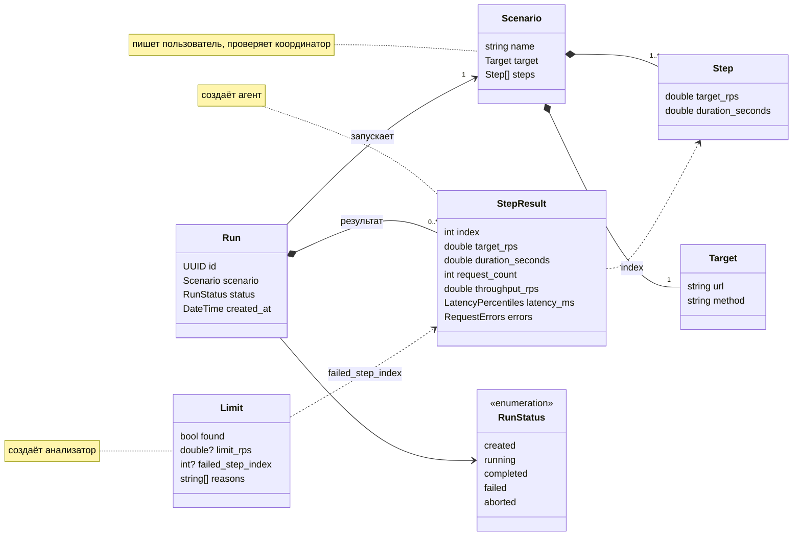
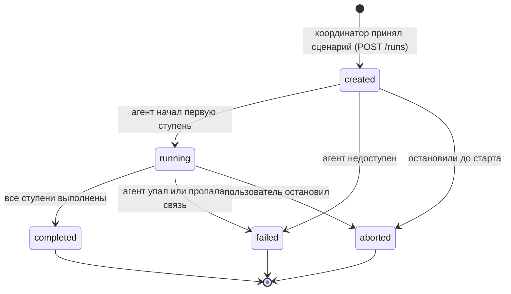

# Доменная модель

Общие сущности Bendmark, которыми обмениваются сервисы. Названия полей совпадают
с [`examples/scenario.yaml`](../examples/scenario.yaml) и
[`examples/result.json`](../examples/result.json).

## Сущности

### Scenario — сценарий

Что и как нагружать. Пишет пользователь, принимает и проверяет **координатор** (`POST /runs`).

| Поле | Тип | Единицы | Описание |
| --- | --- | --- | --- |
| `name` | строка | — | Имя сценария, не пустое |
| `target` | Target | — | Куда подаём нагрузку |
| `steps` | список Step | — | Ступени по порядку, хотя бы одна |

### Target — цель

Часть сценария, отдельно не создаётся.

| Поле | Тип | Единицы | Описание |
| --- | --- | --- | --- |
| `url` | строка | — | Абсолютный `http`/`https` URL. Должен быть доступен **агенту**, а не браузеру пользователя: в Docker это `http://abstock:8080/` |
| `method` | строка | — | HTTP-метод. Сейчас координатор принимает GET, POST, PUT, PATCH, DELETE, HEAD, агент умеет только GET |

### Step — ступень

Часть сценария: отрезок времени с постоянной целевой нагрузкой.

| Поле | Тип | Единицы | Описание |
| --- | --- | --- | --- |
| `target_rps` | число | запр/с | Сколько запросов в секунду планируем отправлять. Конечное, больше нуля |
| `duration_seconds` | число | с | Сколько длится ступень. Конечное, больше нуля, может быть дробным |

### Run — прогон

Один запуск сценария. Создаёт **координатор**, когда принял сценарий.

| Поле | Тип | Единицы | Описание |
| --- | --- | --- | --- |
| `id` | UUID | — | Идентификатор прогона, по нему `GET /runs/{id}` |
| `scenario` | Scenario | — | Копия сценария на момент запуска |
| `status` | строка | — | `created`, `running`, `completed`, `failed`, `aborted`, см. [состояния](#состояния-прогона) |
| `created_at` | дата и время | UTC | Когда прогон создан |

Результат прогона — список StepResult по выполненным ступеням. Координатор собирает
его в `result.json` (поля `scenario_name`, `status`, `steps`).

### StepResult — результат ступени

Что намерили на одной ступени. Создаёт **агент**, по одному на каждую выполненную ступень.

| Поле | Тип | Единицы | Описание |
| --- | --- | --- | --- |
| `index` | целое | — | Номер ступени в сценарии, **с единицы** |
| `target_rps` | число | запр/с | Плановая нагрузка ступени (копия из Step) |
| `duration_seconds` | число | с | Длительность ступени |
| `request_count` | целое | шт. | Сколько запросов завершилось: успешные, HTTP-ошибки и таймауты. Неотправленные не считаются |
| `throughput_rps` | число | запр/с | Пропускная: `request_count / duration_seconds` |
| `latency_ms.p50`, `.p90`, `.p99` | число | мс | Перцентили задержки. Задержка считается **от запланированного** момента отправки до ответа или таймаута |
| `errors.count` | целое | шт. | HTTP 4xx/5xx, таймауты и сетевые ошибки, не больше `request_count` |
| `errors.rate_percent` | число | % | `errors.count / request_count × 100`, округлено до одного знака |

### Limit — предел

Вывод по прогону. Создаёт **анализатор** по списку StepResult.

| Поле | Тип | Единицы | Описание |
| --- | --- | --- | --- |
| `found` | да/нет | — | Нашлась ли ступень с отказом |
| `limit_rps` | число или нет | запр/с | `target_rps` последней ступени без отказа. Нет значения, если отказала первая ступень. Если `found = false`, это нижняя оценка: сервис держит не меньше |
| `failed_step_index` | целое или нет | — | `index` первой ступени с отказом (с единицы). Нет значения, если `found = false` |
| `reasons` | список строк | — | Почему ступень признана отказом: p99 выше порога, пропускная перестала расти, много ошибок. Текст для человека, не для разбора программой |

## Кто что создаёт

## Состояния прогона

- `completed`, `failed` и `aborted` конечные: из них прогон уже никуда не переходит.
- `aborted` — остановка по желанию пользователя, `failed` — сбой, которого никто не хотел.
- Анализатор получает выполненные ступени `completed` и `aborted` прогонов. Для `aborted`
  предел, если не найден, — нижняя оценка только по тем ступеням, что успели пройти.

Сейчас координатор создаёт прогоны только в `created`. Переходы появятся вместе с запуском
агента по gRPC (#32–#34).

## Правила сценария

1. **`target_rps` строго растёт от ступени к ступени.** Каждая следующая ступень нагружает
   сильнее предыдущей: `steps[i].target_rps > steps[i-1].target_rps`. Проверяет
   **координатор при приёме сценария**: если правило нарушено, `POST /runs` отвечает `400`
   с ошибкой поля `steps[i].target_rps` («Нагрузка должна расти: X после Y»). Реализация
   проверки — #35.

   Зачем: предел ищется сравнением соседних ступеней («нагрузку подняли на 50, а пропускная
   выросла на 3»). Если нагрузка не растёт, прирост нагрузки равен нулю или отрицательный,
   и сравнение теряет смысл. Анализатор тоже проверяет это правило, но если ловить его только
   там, пользователь узнает об ошибке после всего прогона, а не до него.

2. Остальное координатор уже проверяет: имя не пустое, URL абсолютный `http`/`https`,
   метод из списка, хотя бы одна ступень, `target_rps` и `duration_seconds` — конечные
   числа больше нуля.

3. Ступени нумеруются с единицы: `StepResult.index = 1` — первая ступень сценария.

## Словарь

| Термин | По-английски | Что значит |
| --- | --- | --- |
| Сценарий | scenario | Цель и список ступеней: что и как нагружать |
| Цель | target | Адрес и метод, по которым агент шлёт запросы |
| Ступень | step | Отрезок времени с постоянной целевой нагрузкой |
| Целевая нагрузка | target rps | Сколько запросов в секунду **планируем** отправить |
| Пропускная | throughput | Сколько запросов в секунду **реально завершилось** |
| Прогон | run | Один запуск сценария |
| Перцентиль p99 | percentile | Задержка, быстрее которой выполнились 99 % запросов |
| Отказ ступени | failed step | Ступень, где p99 выше порога, пропускная перестала расти или ошибок больше порога |
| Предел | limit | Целевая нагрузка последней ступени перед первым отказом |
| Нижняя оценка | lower bound | Предел не найден: сервис выдержал все ступени, значит держит не меньше последней |
| Честный замер | open model | Запросы уходят по расписанию, не дожидаясь ответов на предыдущие. Задержка считается от запланированного момента отправки. Так работает Bendmark |
| Наивный замер | closed model | N виртуальных пользователей: каждый шлёт следующий запрос, только получив ответ. Когда сервис тормозит, генератор сам снижает нагрузку и не видит очередь |
| Coordinated omission | coordinated omission | Ошибка наивного замера: генератор «договаривается» с медленным сервисом, пропускает запросы, которые должен был отправить, и показывает задержку в разы меньше настоящей |
